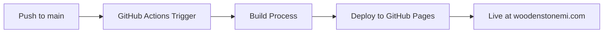
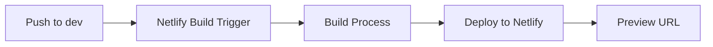

# Deployment Strategy - The Wooden Stone LLC Website

## 🎯 **Current Deployment Setup**

### **Production Deployment (GitHub Pages)**
- **Branch**: `main`
- **Platform**: GitHub Pages
- **Domain**: `woodenstonemi.com`
- **Build**: Automated via GitHub Actions
- **Status**: ✅ **Active**

### **Development Deployment (Netlify)**
- **Branch**: `dev`
- **Platform**: Netlify
- **Purpose**: Development and testing
- **Build**: Manual or automated from dev branch
- **Status**: ⚙️ **Configured but not active**

## 📋 **Deployment Workflow**

### **Production Workflow**


### **Development Workflow**


## 🔧 **Configuration Files**

### **GitHub Pages Configuration**
- **File**: `.github/workflows/deploy.yml`
- **Trigger**: Push to `main` branch
- **Build Command**: `npm run build`
- **Publish Directory**: `dist`
- **Domain**: `woodenstonemi.com` (via CNAME)

### **Netlify Configuration**
- **File**: `netlify.toml`
- **Build Command**: `npm run build`
- **Publish Directory**: `dist`
- **Redirects**: Configured for all pages

## 🚀 **How to Deploy**

### **Production Deployment (Automatic)**
1. **Make changes** to your code
2. **Commit and push** to `main` branch
3. **GitHub Actions** automatically builds and deploys
4. **Site updates** at `woodenstonemi.com`

### **Development Deployment (Manual)**
1. **Switch to dev branch**: `git checkout dev`
2. **Make changes** and commit
3. **Push to dev**: `git push origin dev`
4. **Netlify** builds and deploys (if configured)

### **Local Development**
```bash
# Start development server
npm run dev

# Build for production
npm run build

# Test production build locally
npm start
```

## 📊 **Environment Variables**

### **Production (GitHub Pages)**
Since GitHub Pages is static hosting, environment variables are handled differently:
- **Postmark API**: Configured in backend server
- **Domain**: Set via CNAME file
- **SSL**: Automatic via GitHub Pages

### **Development (Netlify)**
Environment variables can be set in Netlify dashboard:
- `POSTMARK_API_KEY`
- `FROM_EMAIL`
- `TO_EMAIL`
- `NODE_ENV=production`

## 🔒 **Security Considerations**

### **GitHub Pages**
- ✅ **HTTPS**: Automatic SSL certificates
- ✅ **Custom Domain**: Properly configured
- ✅ **Security Headers**: Implemented in build
- ⚠️ **Environment Variables**: Limited (static hosting)

### **Netlify**
- ✅ **HTTPS**: Automatic SSL certificates
- ✅ **Environment Variables**: Full support
- ✅ **Security Headers**: Configurable
- ✅ **Form Handling**: Built-in support

## 📈 **Monitoring & Analytics**

### **GitHub Pages**
- **Analytics**: Can integrate Google Analytics
- **Monitoring**: GitHub Actions logs
- **Performance**: GitHub Pages CDN

### **Netlify**
- **Analytics**: Built-in analytics
- **Monitoring**: Netlify dashboard
- **Performance**: Global CDN

## 🛠️ **Troubleshooting**

### **Common Issues**

**GitHub Pages Not Updating**
1. Check GitHub Actions logs
2. Verify build process
3. Check CNAME configuration
4. Wait for DNS propagation

**Netlify Build Fails**
1. Check build logs
2. Verify environment variables
3. Test build locally
4. Check dependency versions

**Domain Issues**
1. Verify CNAME file
2. Check DNS settings
3. Wait for propagation
4. Contact hosting provider

## 📝 **Best Practices**

### **Development Workflow**
1. **Always work on dev branch** for new features
2. **Test locally** before pushing
3. **Use descriptive commit messages**
4. **Review changes** before merging to main

### **Deployment Workflow**
1. **Test on dev** before production
2. **Monitor deployment** logs
3. **Verify functionality** after deployment
4. **Keep backups** of important configurations

### **Maintenance**
1. **Regular updates** of dependencies
2. **Monitor performance** metrics
3. **Backup configurations** regularly
4. **Document changes** in deployment logs

## 🎯 **Recommendations**

### **Current Setup Assessment**
- ✅ **Production**: Well-configured and working
- ⚙️ **Development**: Configured but underutilized
- ✅ **Security**: Properly implemented
- ✅ **Performance**: Optimized for speed

### **Future Improvements**
1. **Activate Netlify** for development testing
2. **Set up staging environment** for testing
3. **Implement automated testing** in CI/CD
4. **Add performance monitoring** tools

---

**Last Updated**: December 2024  
**Status**: ✅ **Production Ready**  
**Next Steps**: Consider activating Netlify for development workflow
